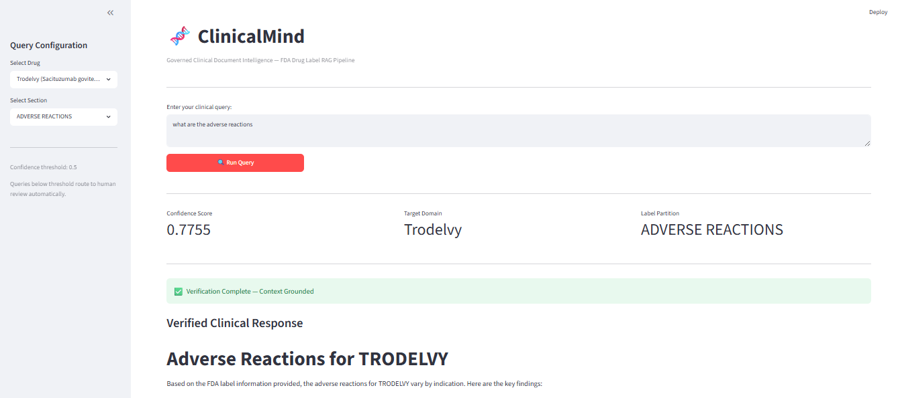
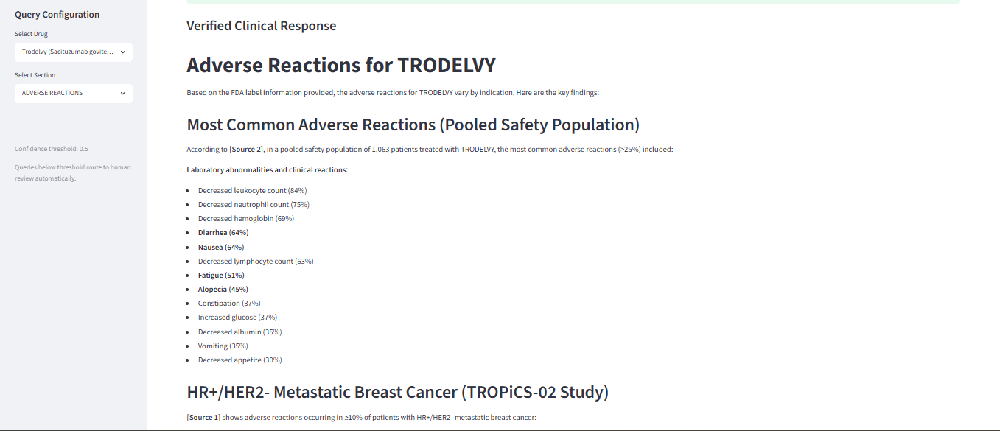

# ClinicalMind

A governed, enterprise-grade clinical RAG prototype built on multi-drug FDA labels, demonstrating confidence-based response routing, context-hydrated retrieval, and traceable GxP audit logging.

---

## 📋 Problem Statement

Clinical, medical, and regulatory commercial operations teams frequently need to locate explicit, authoritative information from lengthy, dense FDA structured product labels (SPL).

* **The Traditional Gap:** Conventional keyword search lacks deep semantic understanding and structural context awareness.
* **The LLM Risk:** Generic AI assistants frequently generate answers without sufficient supporting evidence, operate outside the approved source parameters, or hallucinate clinical variables.

ClinicalMind explores a **governance-first retrieval architecture** designed for life sciences environments where low-confidence queries are cleanly intercepted and routed for human review instead of forcing an ungrounded AI-generated response.

> **Core Philosophy:** In regulated GxP environments, an uncertain answer is significantly more dangerous than no answer.

---

## ✨ Key Features

* **Config-Driven Ingestion Engine** – Adding a new pharmaceutical product requires zero pipeline code changes. The engine dynamically auto-discovers newly added PDF files and corresponding JSON configuration mappings at runtime.
* **Section-Aware FDA Label Chunking** – Abandons arbitrary token-length splitting to preserve strict structural document boundaries (e.g., `INDICATIONS AND USAGE`, `WARNINGS AND PRECAUTIONS`) during ingestion, preventing toxic cross-contamination of unrelated clinical variables.
* **Hybrid Intent-Driven Routing** – Eliminates the "dual source of truth" conflict. If a user defines targeted constraints via the Streamlit dashboard dropdown sidebars, the entry node intercepts execution, enforces those boundaries, and bypasses LLM inference entirely. If the query is unstructured, it falls back to a semantic entity extraction parser using Claude.
* **Context-Hydrated Isolated Retrieval** – Automatically patches shorthand user questions (e.g., *"give me the adverse reactions"*) by dynamically injecting explicit structured metadata context before text vectorization. This optimizes semantic proximity math at the database layer while maintaining sharp pre-retrieval metadata isolation inside Pinecone.
* **Confidence-Based Governance Gate** – Enforces a strict mathematical safety boundary ($0.5000$). If the maximum vector proximity score drops below the threshold, the system triggers an emergency brake, blocking downstream generation to eliminate hallucination risks, and diverts the execution state to a human escrow node.
* **Source-Cited Responses** – Restricts generation to the retrieved source context, mapping generated answers back to exact FDA label sections and source fragments using Claude 4.5 Sonnet.
* **21 CFR Part 11 Traceable Audit Trail** – Records the complete deterministic lifecycle of every single execution state inside an append-only JSONL log ledger capturing timestamps, queries, hydrated inputs, metadata filters, raw match scores, and generation previews.
* **Streamlit Control Dashboard** – Interactive web interface for running queries, configuring manual sidebar parameters, and visualizing vector match metrics and system traces in real time.

---

## 📐 Architecture Overview

### Data Ingestion Flow (Config-Driven)

```text
Multi-Drug FDA Label PDFs + JSON Configs
                │
                ▼
      PyMuPDF Text Extraction
                │
                ▼
     Section-Aware Chunking 
 (Preserves FDA Label Boundaries)
                │
                ▼
       Metadata Enrichment 
 {drug_name, section_name, doc_type}
                │
                ▼
        OpenAI Embeddings 
   (text-embedding-3-small)
                │
                ▼
     Pinecone Vector Store 
  (Metadata-Filtered Indexing)
```

### Runtime Query Execution State Machine

```text
      Streamlit UI User Query & Sidebar Dropdowns
                           │
                           ▼
             ┌───────────────────────────┐
             │    Intent Router Node     │ ◄── Enforces explicit UI sidebar limits
             └─────────────┬─────────────┘     or falls back to LLM entity parsing
                           │
                           ▼
             ┌───────────────────────────┐
             │  Isolated Retrieval Node  │ ◄── Inject Context Hydration Engine &
             └─────────────┬─────────────┘     apply strict database metadata filters
                           │
                           ▼
             ┌───────────────────────────┐
             │  Confidence Check Gate    │
             └─────────────┬─────────────┘
                           │
            ┌──────────────┴──────────────┐
            │ Score < 0.5000              │ Score >= 0.5000
            ▼                             ▼
┌───────────────────────┐     ┌───────────────────────┐
│   Human Escrow Node   │     │Grounded Response Node │
│ (Safety Isolation ⚠️) │     │  (Claude 4.5 Sonnet)  │
└───────────┬───────────┘     └───────────┬───────────┘
            │                             │
            └──────────────┬──────────────┘
                           ▼
             ┌───────────────────────────┐
             │    21 CFR Part 11 Audit   │ ◄── Immutably seals transaction state
             └───────────────────────────┘
```

---

## 🛠️ Technology Stack

| Component | Technology | Purpose |
|---|---|---|
| Workflow Orchestration | LangGraph | State-based deterministic workflow control |
| LLM Engine | Claude 4.5 Sonnet | Entity parsing fallback & Grounded response generation |
| Embeddings | OpenAI `text-embedding-3-small` | 1536-dimensional semantic vector representations |
| Vector Database | Pinecone | Similarity search with native metadata filtering |
| PDF Processing | PyMuPDF | Structured FDA label text parsing |
| Frontend UI | Streamlit | Control dashboard & verification interface |
| Logging Ledger | JSONL | Append-only GxP traceable transaction log trail |

---

## 🗂️ Repository Structure

```text
clinicalmind/
├── app.py                      # Streamlit User Interface and Dashboard Configuration
├── README.md                   # Main System Documentation
├── requirements.txt            # Python Dependencies
├── config/                     # Multi-Drug Runtime Configuration Maps
│   ├── default_config.json
│   ├── leqembi_config.json
│   ├── trodelvy_config.json
│   └── keytruda_config.json
├── src/
│   ├── indexer/
│   │   └── create_index.py     # Pinecone Index Provisioning Script
│   ├── ingestion/
│   │   ├── load_documents.py
│   │   ├── chunk_documents.py
│   │   ├── store_embeddings.py
│   │   └── architected_ingestion.py # Config-Driven Orchestrated Ingestion Pipeline
│   └── pipeline/
│       └── langgraph_pipeline.py    # Main Core State Machine (Nodes, Gates, and Logic)
└── docs/
    └── audit_log.jsonl         # Append-Only Transaction Evaluation Trail
```

---

## ⚙️ Setup

### Clone Repository

```bash
git clone https://github.com/naran36usa-pixel/clinicalmind.git
cd clinicalmind
```

### Create and Activate Virtual Environment

```bash
# Windows PowerShell
python -m venv venv
.env\Scriptsctivate
```

### Install Dependencies

```bash
pip install -r requirements.txt
```

### Configure Environment Variables

Create a `.env` file in the project root:

```env
ANTHROPIC_API_KEY=your_production_anthropic_key
OPEN_AI_API_KEY=your_production_openai_key
PINECONE_API_KEY=your_production_pinecone_key
```

---

## 🚀 Running the Project

### Execute Ingestion (Multi-Drug Automation)

To automatically process all configured FDA labels, extract sections, generate embeddings, and populate your Pinecone vector index, run:

```bash
python src/ingestion/architected_ingestion.py
```

### Launch the Control Dashboard

To launch the interactive user interface and view validation states:

```bash
streamlit run app.py
```

The application will open automatically in your browser at `http://localhost:8501`.

---

## 🖥️ System Interface & Validation States

The system enforces a strict mathematical compliance gate using vector match proximity scores. Below is a comparison of how the user interface dynamically adapts based on the data layer's confidence metrics.

### Architectural Breakdown

#### 🟢 State 1: Grounded Context Path

**Behavior:** When vector math validation yields a top chunk match score $\ge 0.5000$, the metadata query hydration engine optimizes the embedding footprint by merging UI selections with the raw query. The system unlocks downstream inference, generating an answer fully grounded in the isolated reference documentation.

#### 🔴 State 2: Risk Mitigation Path

**Behavior:** When vector proximity scores drop below the hardcoded $0.5000$ boundary limit due to keyword scarcity or out-of-domain input, the compliance gate halts execution. Downstream model access is blocked to prevent hallucinations, and the state machine safely diverts the transaction to a human review escrow node.

---

<table>
  <tr>
    <td align="center"><b>State 1: Grounded Inference (Pass)</b></td>
    <td align="center"><b>State 2: Compliance Escrow (Intercept)</b></td>
  </tr>
  <tr>
    <td></td>
    <td></td>
  </tr>
</table>

---

## 🧪 Example Executions

### Scenario A: High-Confidence UI Boundary Override (Query Hydration)

**User Input via UI**

Sidebar Selector: `Trodelvy (Sacituzumab govitecan-hziy)` | `ADVERSE REACTIONS`

Text Input Box: `"give me the adverse reaction"`

**System Trace Logs**

```text
🧠 [Intent Router] Evaluating query boundaries: 'give me the adverse reaction'
🧬 [Intent Router] Enforcing explicit UI-driven boundaries: ['Trodelvy (Sacituzumab govitecan-hziy)'] | Section: ADVERSE REACTIONS
⚙️ [Retrieval Agent] Executing isolated database query loop for ['Trodelvy (Sacituzumab govitecan-hziy)']...
   🔧 Context Hydration Injection -> Optimized String: 'give me the adverse reaction (Context: Target pharmaceutical product is Trodelvy (Sacituzumab govitecan-hziy))'
   📑 [Match Score: 0.7324] Product: Trodelvy | Sec: ADVERSE REACTIONS
🛡️ [Confidence Check] Max Vector Score: 0.7324 | Gate Limit: 0.5 | Escalation Status: False
🔀 [Router Path] Advancing to final response generation node.
```

---

### Scenario B: Low-Confidence / Out-of-Domain Block

**User Text Input Box**

```text
What is the engine layout of a Boeing 737?
```

**System Trace Logs**

```text
🧠 [Intent Router] No UI boundary constraints detected. Running LLM semantic entity parser...
   [Intent Router] Extracted Entities -> Drugs: [] | Section: None
⚙️ [Retrieval Agent] Short-circuiting execution: No recognized drug domain specified.
🛡️ [Confidence Check] Max Vector Score: 0.0000 | Gate Limit: 0.5 | Escalation Status: True
🔀 [Router Path] Diverting to human escrow node.
⚠️ [Human Review Node] Flagging trace logs for escrow...
```

---

## 📜 Sample Trace Audit Log Entry

```json
{
  "timestamp": "2026-06-05T05:33:34.207359+00:00",
  "query": "give me the adverse reaction",
  "detected_drugs": ["Trodelvy (Sacituzumab govitecan-hziy)"],
  "section_filter": "ADVERSE REACTIONS",
  "confidence_score": 0.7324,
  "requires_human_review": false,
  "retrieved_chunks": 4,
  "retrieval_scores": [0.7324, 0.7274, 0.7259, 0.7214],
  "response_preview": "Based on the FDA structured label for Trodelvy...",
  "error": ""
}
```

---

## 🛑 Limitations

* **Demonstration Boundaries:** Evaluation is scaled for multi-drug demonstration and is not yet production-validated.
* **Simulated Escrow:** The human review dashboard resolution workflow is simulated within the state graph output rather than hooking into a downstream ticket system.
* **Local Security:** Local JSONL audit logs function on append-only logic but lack cryptographic block hashing or distributed storage validation.
* **Regulatory Compliance:** The platform functions as a document intelligence utility and is not validated for direct clinical decision-making or official regulatory use.

---

## 🔮 Future Direction

* **Cryptographic Trail Verification:** Upgrade the append-only audit ledger to utilize SHA-256 block hashing or ledger database endpoints to achieve absolute non-repudiation tracking.
* **Cross-Section Synthesis:** Refactor the retrieval agent to support compound list evaluation (e.g., scanning `ADVERSE REACTIONS` and `BOXED WARNINGS` concurrently) when answering highly complex safety queries.
* **Interactive Human Escrow Resolution:** Expand the Streamlit interface to include a dedicated auditor view that allows an expert to manually inject the missing context when the confidence gate drops a query to escrow.

---

## ⚖️ Disclaimer

This project is a technical demonstration of governance-oriented RAG architecture patterns. It is not a validated clinical system and should not be used for patient care, medical advice, or regulatory decision-making.
